# Journal des versions

Ce qui change d'une version d'Euclide à l'autre.

## 0.6.1

- Sous Linux, passer en mode projection, ou changer de thème ou de densité, ne ferme plus Euclide.
- **Statistiques d'utilisation** : une fois par jour, Euclide envoie à son auteur le temps passé dans chaque partie de l'application et le nombre de notes, d'imports ou de scripts lancés. Jamais de nom, de titre ni de document. Dans Réglages, Données, on voit ce qui part, et on peut le couper.
- L'installateur Windows et le fichier README.txt de la version portable sont en français.

## 0.6.0

### PDF

- **Annoter** : stylo, surligneur, formes, gomme et notes de texte. Tout est enregistré dans le PDF, et se voit dans n'importe quel lecteur.
- **Annuler et Rétablir** ont leurs boutons, pour le stylet.
- **Présenter** (F5) : une page en plein écran. La télécommande tourne les pages, et on écrit dessus.
- **Imprimer** (Ctrl+P), ou **exporter une copie** avec les annotations, à envoyer aux élèves.
- **Remplir un formulaire** et l'enregistrer.
- **Chercher** dans le document (Ctrl+F).
- **Le menu Pages** tourne, insère, déplace, supprime ou extrait des pages, et ajoute un PDF à la suite. L'ancienne version reste dans l'historique.
- Un PDF protégé par un mot de passe le demande, au lieu de refuser de s'ouvrir.

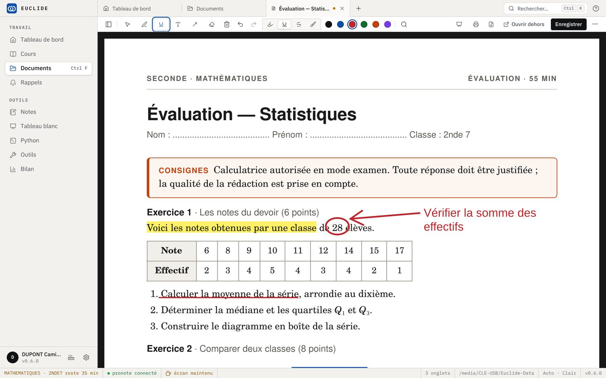

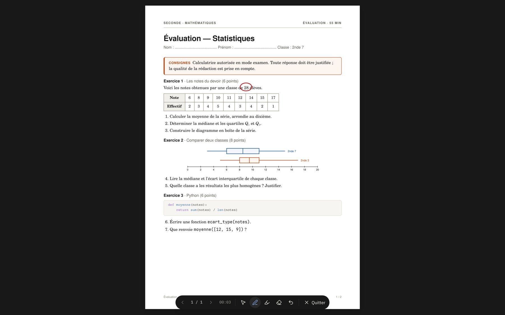

### Images

- **Une photo ou un scan** s'annote avec les mêmes outils, se présente et s'imprime. L'image elle-même ne change pas.
- Ce qui était déjà dessiné sur une image est gardé.

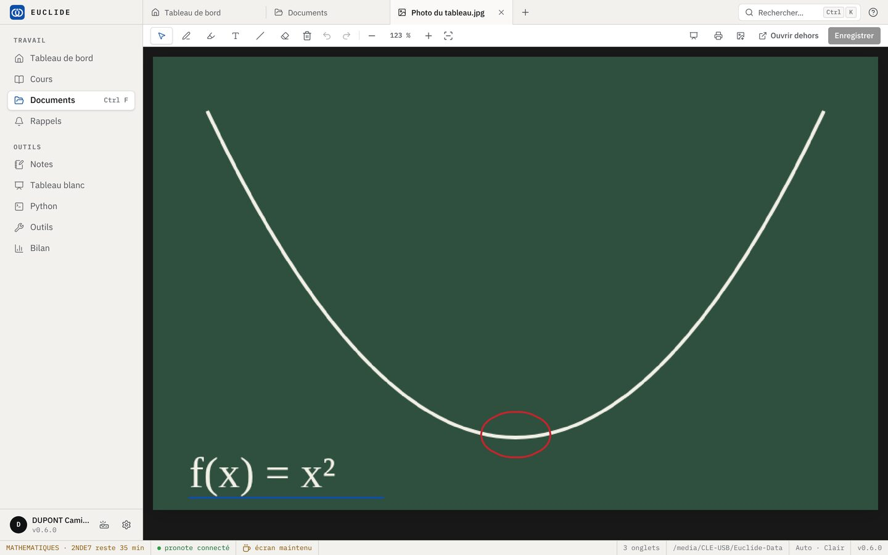

### Aussi

- **Nouveautés** : après une mise à jour, Euclide montre tout ce qui a changé depuis la version d'avant. On les retrouve dans Réglages, À propos.
- La recherche d'Euclide donne la page où se trouve le mot, et ouvre le PDF dessus.
- En mode projection, les traits fins, les textes pâles et le bouton qu'on presse se voient mieux.
- **Les diapositives** d'une note ont une barre pour avancer, reculer et quitter, comme un PDF présenté : un écran tactile n'a pas de clavier.
- Au tableau blanc, la main posée sur l'écran pendant qu'on écrit au stylet ne zoome plus et ne coupe plus le trait.

### À savoir

- Au premier démarrage, Euclide relit les PDF en arrière-plan, pendant quelques minutes.

## 0.5.0

### En classe

- **Les élèves de chaque classe**, chargés d'un coup depuis Pronote (Outils, « Charger depuis Pronote »), ou collés dans Cours (onglet Classes du cours).
- **Tirer un nom au sort**, sur l'écran de classe (Ctrl+Maj+H). Un nom tiré ne revient pas avant « Recommencer ». Espace ou la télécommande tire le suivant.
- **Faire des groupes**, d'une taille ou d'un nombre donné.
- **Le hasard** : un dé, un nombre, pile ou face.
- **Un chronomètre**, à côté du minuteur.
- **Un QR code** pour une adresse ou un texte, en plein écran. Chaque lien des Outils a le sien.

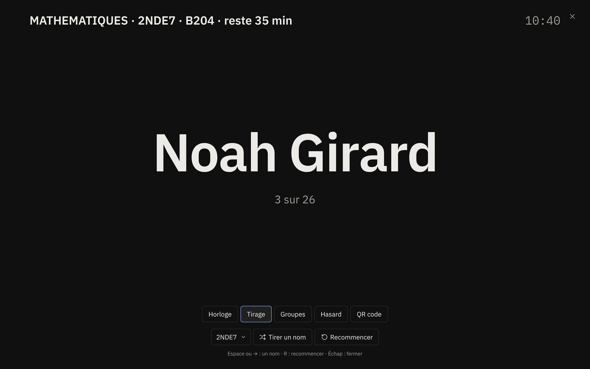

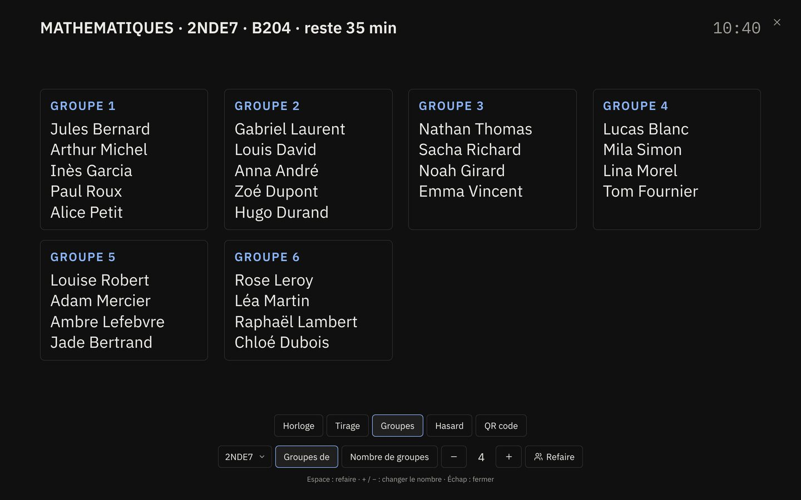

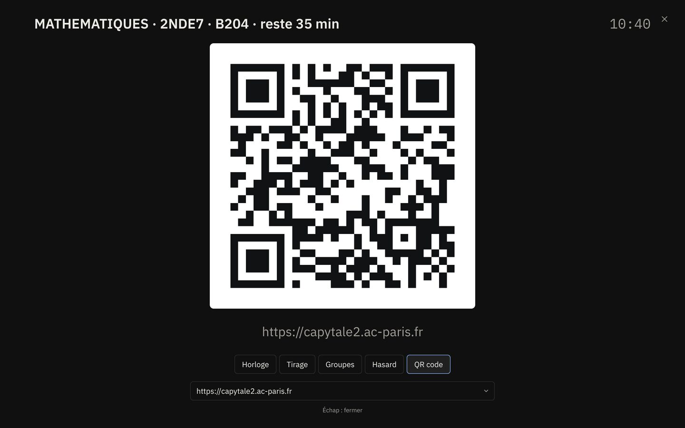

### Notes

- **Des tableaux**, à insérer ou à coller depuis un tableur.
- **Des images**, collées, choisies ou glissées dans la note.
- Du texte barré, des cases à cocher, des notes de bas de page.

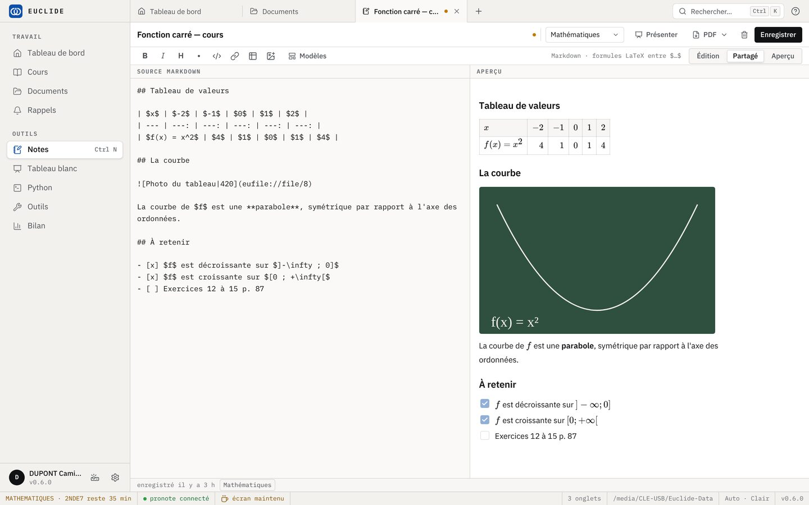

### Tableau blanc

- **Des formules** en LaTeX (outil Σ), nettes à tout zoom.
- **Des images**, sous le dessin : on écrit dessus sans les effacer.
- **La sélection** déplace, agrandit ou supprime un élément.
- **Des pages**, tournées avec ‹ et › ou la télécommande. L'export PDF en met une par feuille.

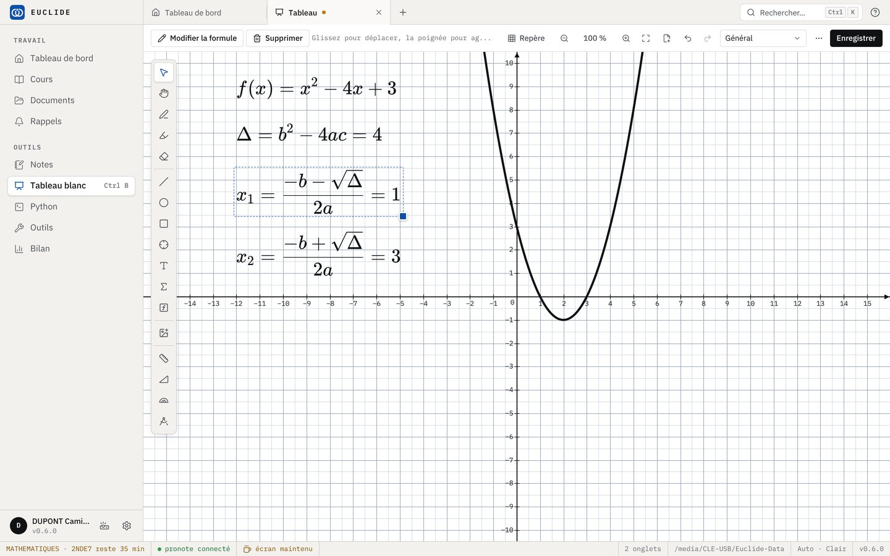

### À savoir

- Les données passent au format 4. Euclide en fait d'abord une copie dans Euclide-Sauvegardes. Ensuite, une version plus ancienne d'Euclide ne les ouvre plus.

## 0.4.2

- Une mise à jour enregistre le travail ouvert, puis Euclide redémarre tout seul.
- Le tableau blanc s'enregistre tout seul.
- Une note sans titre garde son texte.
- Une erreur reste dans son onglet : les autres continuent.
- Une action qui échoue le dit, au lieu de ne rien faire.
- Un PDF ouvert à côté ne prend plus Retour arrière, Suppr et Ctrl+Z aux notes.
- Un lien dans un PDF ou une note s'ouvre dans le navigateur.
- Une clé USB qui change de lettre retrouve ses données.
- Une restauration ou une archive interrompue ne laisse rien à moitié fait.
- Le mot de passe et le jeton Pronote ne partent plus dans les sauvegardes.

## 0.4.1

- Les mises à jour s'installent bien plus vite sur une clé USB.
- L'en-tête de la barre latérale ne garde que le nom d'Euclide.

## 0.4.0

### En classe

- **Des séances prêtes.** Chaque étape d'une progression garde ses documents, notes, tableaux et scripts. « Ouvrir la séance » ouvre tout d'un coup.
- **L'horloge et le minuteur** en plein écran, pour le vidéoprojecteur (Ctrl+Maj+H).
- **Le cahier de textes Pronote**, rangé par semaine.

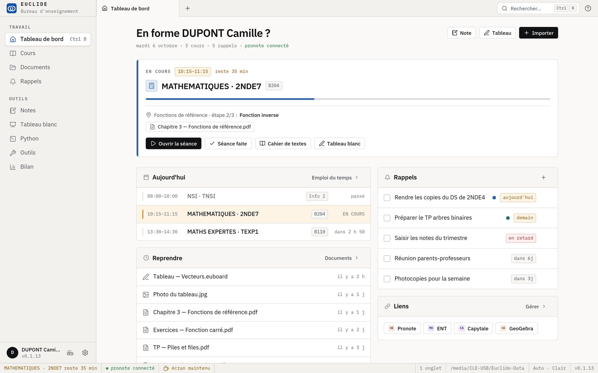

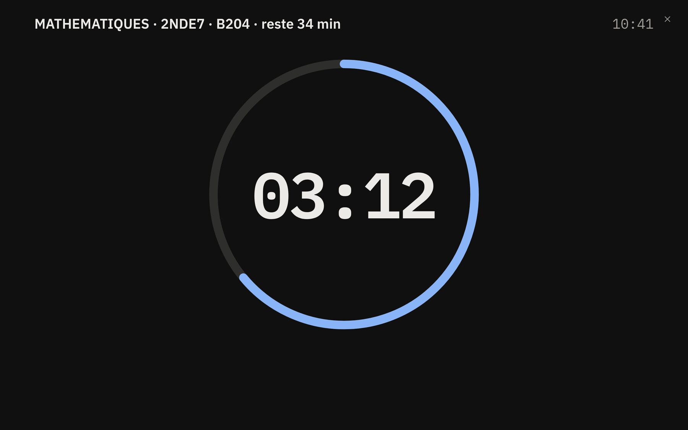

### Tableau blanc

- Une feuille infinie, sur fond Seyès, petits carreaux ou repère.
- **Règle, équerre, rapporteur et compas**, à leur vraie taille.
- Des figures exactes qui s'accrochent aux points, et des courbes de fonctions.
- Export en PNG et en PDF.

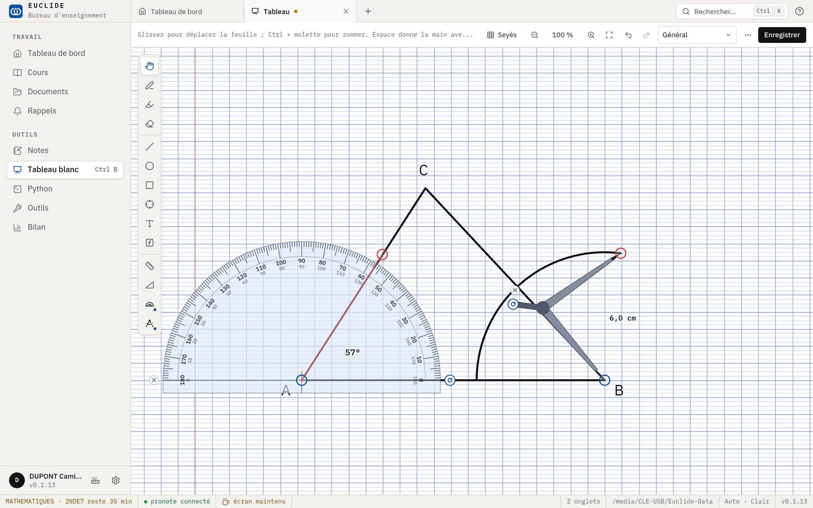

### Python

- **turtle et matplotlib** dessinent dans Euclide, sans rien installer.
- **« Vérifier »** corrige un exercice à partir de ses exemples.
- **143 modèles de scripts**, de la Seconde à la Terminale, en Maths expertes et en NSI.

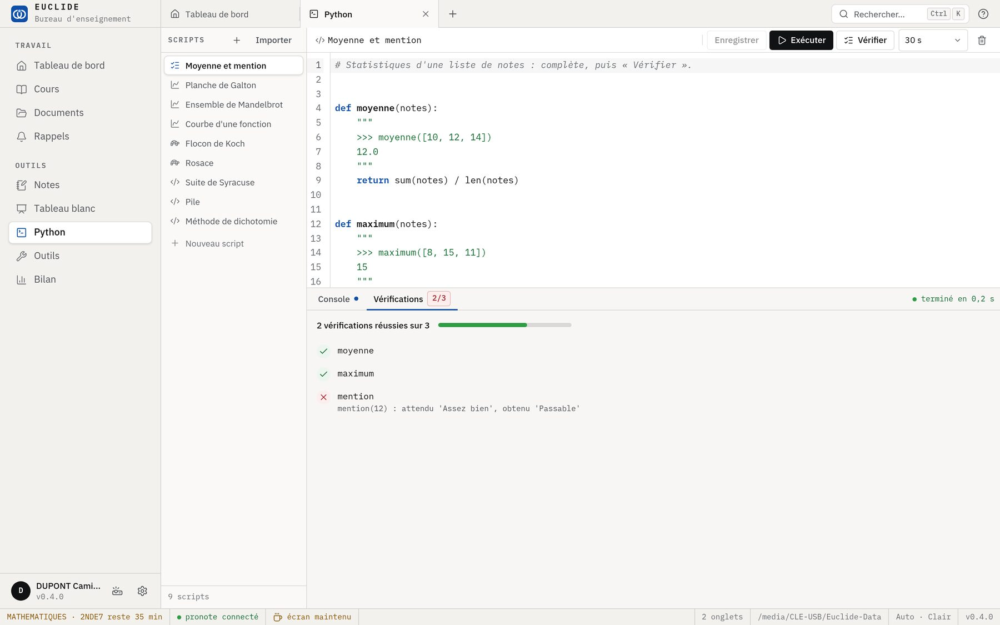

### Notes

- Une note devient un **diaporama** (F5).
- Export en PDF, et impression.
- Des modèles : cours, exercices, évaluation, fiche méthode.

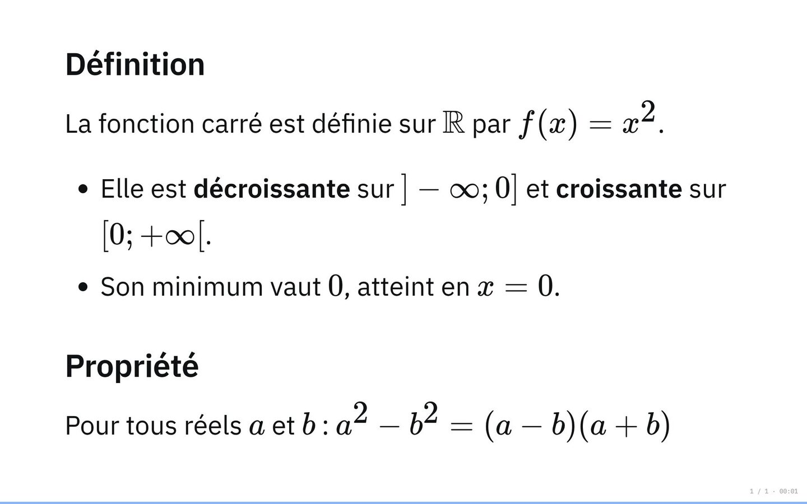

### Et aussi

- Les documents en grille, avec leurs aperçus, et une recherche dans leur texte.
- Un nouveau logo, un nouveau design, et un thème sombre.
- Pronote ne redemande plus le mot de passe à chaque ouverture.
- Fermer la fenêtre ne perd plus de travail.

## 0.3.0

**Plus rapide**

- La fenêtre s'ouvre directement à la bonne taille, dans le bon thème, avec les onglets de la séance précédente.
- Plus rien ne fige l'interface : imports, enregistrements et recherche se font en arrière-plan.
- Les PDF s'ouvrent plus vite (1,2 s d'attente en moins à chaque ouverture) ; les fichiers ne sont plus recopiés à l'ouverture.
- Recherche plein texte dans les notes et les PDF.
- Python ne démarre plus au lancement, seulement quand on en a besoin.

**Vos données**

- Sauvegarde automatique chaque jour dans « Euclide-Sauvegardes » (7 jours + 4 semaines), et dans un dossier externe au choix.
- Les documents supprimés restent 30 jours dans la corbeille ; les versions des documents annotés sont conservées.
- La base est vérifiée au démarrage et copiée avant chaque mise à niveau.

**Sécurité**

- Le mot de passe Pronote n'est plus enregistré en clair (chiffré pour l'utilisateur Windows).
- Politique de sécurité du contenu et permissions réduites au strict nécessaire.
- Un seul Euclide à la fois : un deuxième lancement ramène la fenêtre ouverte.

**Mises à jour**

- La version portable remplace son module Python d'un bloc, et Euclide indique la nouvelle version au démarrage suivant.
