# Journal des versions

Ce qui change d'une version d'Euclide à l'autre.

## 0.6.0

### PDF

- **Un nouveau moteur.** Les PDF s'affichent avec PDFium, le moteur de Chrome. Les pages se dessinent à part, sans bloquer la fenêtre, et restent nettes à tout zoom. Ctrl + molette zoome autour du pointeur.
- **Ce qui est dessiné va dans le fichier**, en annotations ordinaires : un autre lecteur PDF les montre aussi. Un trait, une note ou une forme se déplace, s'agrandit, s'efface.
- **Annuler et Rétablir** ont leurs boutons, pour un stylet sans Ctrl+Z.
- **Le stylo** a trois épaisseurs. **Le surligneur** marque le texte qu'on balaie, et trace à main levée ailleurs : dans une marge, sur un scan. Il souligne et barre aussi.
- **Des formes** : un trait, une flèche, un rectangle, une ellipse. **La gomme** efface ce qu'elle touche.
- **Une note de texte** s'agrandit pendant qu'on écrit. Laissée vide, elle disparaît.
- **Les formulaires** se remplissent et s'enregistrent dans le fichier.
- **Ctrl+F cherche dans le document.** Chaque mot trouvé est surligné, Entrée passe au suivant. Le panneau des pages montre aussi le sommaire du PDF, quand il en a un.
- **Présenter** (F5) : une page à la fois, en plein écran. Les touches d'une télécommande de présentation tournent les pages. Le stylo, le surligneur, la gomme et un pointeur restent à portée, et ce qui est dessiné reste dans le document.
- **Imprimer** (Ctrl+P) : les pages comme à l'écran, avec ce qui est dessiné dessus.
- **Exporter une copie** : les annotations et les champs remplis y sont fixés, comme sur papier. C'est la copie à envoyer aux élèves.
- **Le menu Pages** tourne une page pour de bon, en insère une blanche ou à petits carreaux, la déplace, la supprime, ajoute un autre PDF à la fin, ou extrait des pages dans un nouveau document. L'ancienne version reste dans l'historique, et « Annuler » la ramène.
- **Un PDF protégé par un mot de passe** le demande, au lieu de refuser de s'ouvrir. Euclide ne le garde pas, et le fichier reste protégé.

### Recherche

- **Un mot trouvé dans un PDF dit sa page**, et ouvre le PDF sur ce mot, surligné.
- La recherche lit les 300 premières pages d'un PDF, au lieu de 60. Un PDF dont les pages changent est relu.

### Partout

- **En mode projection**, les traits fins et les textes pâles sont plus foncés : ils restent lisibles au vidéoprojecteur.
- Passer du thème clair au thème sombre se fait en fondu, sans éclair.
- Dans une fenêtre basse, les outils du tableau blanc se rangent sur deux colonnes : aucun n'est caché.
- Dans une barre étroite, « Ouvrir dehors » devient une icône : le zoom du PDF reste dans la barre.
- Les menus s'ouvrent depuis leur bouton, et un bouton cède un peu sous le clic.

### À savoir

- Au premier démarrage, Euclide relit les PDF en arrière-plan, pour savoir sur quelle page est chaque mot. Cela peut prendre quelques minutes, pendant lesquelles la recherche dans les PDF reste celle d'avant.

## 0.5.0

### En classe

- **Les élèves de chaque classe.** Sur la page d'une classe, la liste se charge depuis Pronote, ou se colle, un nom par ligne. Elle reste sur la clé, avec les données d'Euclide.
- **Tirer un nom au sort.** Sur l'écran de classe (Ctrl+Maj+H), « Tirage » tire un nom dans la classe en cours. Un nom tiré ne revient pas avant « Recommencer ». Espace, Entrée ou → tirent le suivant : une télécommande de présentation suffit.
- **Faire des groupes**, d'une taille donnée ou en un nombre donné. + et − changent le nombre, Espace refait les groupes.
- **Le hasard** : un dé, un nombre entre deux bornes, pile ou face. Chaque élève et chaque face ont la même chance.
- **Un chronomètre**, à côté du minuteur, dans la barre d'onglets et sur l'écran de classe. C le lance ou l'arrête, T note un tour.
- **Un QR code** pour une adresse ou un texte, en plein écran : les élèves le scannent au lieu de recopier l'adresse. Chaque lien des Outils a son bouton QR code.

  
  

### Notes

- **Des tableaux.** Le bouton Tableau en insère un, à remplir. Des cellules copiées depuis un tableur (LibreOffice, Excel) deviennent un tableau quand on les colle, et les colonnes de nombres s'alignent à droite.
- **Des images.** Une capture d'écran collée, une image choisie avec le bouton Image ou glissée depuis l'explorateur s'ajoute à l'endroit du curseur. Elle rejoint aussi les documents du cours. `` règle sa largeur, et Ctrl+Z l'enlève.
- Aussi : du texte barré, des cases à cocher, des notes de bas de page.

### Tableau blanc

- **Des formules.** L'outil Σ écrit une formule en LaTeX là où on touche la feuille, et la montre pendant qu'on la tape. Elle reste nette à tout zoom, on peut écrire par-dessus, et elle part dans les exports.
- **Des images**, collées, choisies ou glissées sur la feuille. Elles restent sous le dessin : on écrit dessus, et la gomme ne les efface pas.
- **La flèche de sélection** déplace un élément, l'agrandit par sa poignée, et Suppr l'enlève.
- **Des pages.** Le bouton Nouvelle page en ajoute une. ‹ et ›, ou PgPréc et PgSuiv (les touches d'une télécommande de présentation), tournent les pages. L'export PDF imprime une page par feuille.

### À savoir

- Euclide met ses données à jour pour les listes d'élèves (format 4). Il en fait d'abord une copie dans Euclide-Sauvegardes. Ensuite, une version plus ancienne d'Euclide ne les ouvre plus.

## 0.4.2

**Enregistrez votre travail avant d'installer cette mise à jour.** Elle s'installe encore comme les précédentes : Euclide se ferme sans enregistrer. C'est la dernière fois. À partir de la suivante, Euclide enregistre tout seul avant d'installer, puis se rouvre sur la nouvelle version.

### Votre travail

- Une note sans titre garde son texte : en l'enregistrant, elle s'appelle « Nouvelle note ».
- Le tableau blanc s'enregistre tout seul, quelques secondes après chaque changement et quand on passe à un autre onglet.
- Un onglet qu'on enregistre en le fermant se ferme vraiment.
- Une mise à jour enregistre d'abord le travail ouvert, puis Euclide redémarre sur la nouvelle version.
- Sur un PC lent, fermer la fenêtre laisse le temps d'enregistrer : Euclide attend la page jusqu'à 5 secondes, au lieu de 2.
- Une erreur reste dans son onglet : « Cet onglet a rencontré une erreur », avec Réessayer et Fermer l'onglet. Les autres onglets continuent.
- Une action qui échoue le dit, au lieu de ne rien faire : supprimer une note, un lien, un cours ou un créneau de l'emploi du temps, déconnecter Pronote…

### PDF

- Un PDF laissé en mode stylo, surligneur ou texte ne prend plus les touches des autres onglets : Retour arrière, Suppr et Ctrl+Z fonctionnent à nouveau dans les notes.
- Un lien dans un PDF ou dans une note s'ouvre dans le navigateur. Il ne remplace plus la fenêtre d'Euclide.
- Ouvrir une ancienne version demande d'abord quoi faire des annotations non enregistrées.
- Le PDF sait ce qui n'est pas enregistré : une annotation effacée après l'enregistrement compte, et enregistrer sans rien de nouveau ne crée plus de version.

### Vos données

- Une restauration impossible (sauvegarde disparue ou abîmée) laisse les données telles qu'elles sont, et le dit au démarrage et dans Réglages, Sauvegardes.
- L'« Archive complète » est écrite en entier ou pas du tout : une clé retirée pendant l'écriture ne laisse pas d'archive à moitié faite.
- Une clé USB qui change de lettre (E: devenu F:) retrouve le dossier de données choisi. S'il reste introuvable, Euclide le dit et propose de le chercher, d'utiliser Euclide-Data ou de quitter, au lieu de repartir d'un dossier vide.
- La clé qui protège le mot de passe Pronote ne part plus dans les sauvegardes, et le jeton de connexion Pronote est chiffré lui aussi. Après une restauration, Pronote demande seulement de se reconnecter.

### Et aussi

- Une nouvelle version n'est proposée qu'une fois publiée en entier et vérifiée, pour tous les systèmes.
- Les erreurs de Python sont notées dans le journal d'Euclide.
- La fenêtre de connexion à Pronote retrouve ses accents.

## 0.4.1

- Le module Python d'Euclide passe d'environ 5 700 fichiers à moins de 900 : une mise à jour s'installe bien plus vite sur une clé USB, et la première ouverture qui suit aussi. Les fichiers retirés aidaient la complétion pour des bibliothèques qu'un script de cours ne peut pas importer ; la complétion ne change pas.
- Une mise à jour qui garde le même module Python ne le réécrit plus sur la clé : seul le programme change.
- L'en-tête de la barre latérale ne garde que le nom d'Euclide.

## 0.4.0

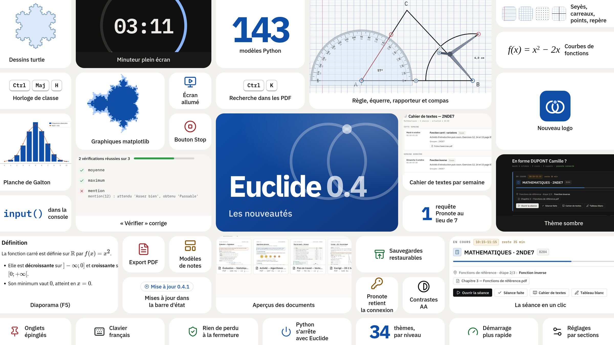

### En classe

- **Des séances prêtes.** Chaque étape d'une progression garde ce qu'il lui faut : documents, notes, tableaux, scripts Python, liens. Sur le tableau de bord, « Ouvrir la séance » ouvre tout d'un coup, et « Séance faite » fait passer la classe à l'étape suivante.
- **L'horloge de classe.** Horloge et minuteur plein écran pour le vidéoprojecteur (Ctrl+Maj+H) : un chiffre de 1 à 9 lance un minuteur d'autant de minutes, Espace le met en pause, + et − ajoutent ou retirent une minute. L'anneau se vide, le cours en cours s'affiche, un carillon discret sonne la fin. L'écran reste allumé pendant les cours.
- **Le cahier de textes Pronote, rangé par semaine**, sur 4 semaines, 3 mois ou l'année. Son texte se sélectionne et se copie.

  
  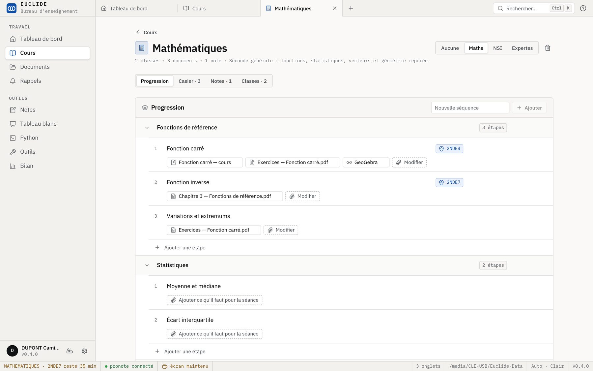

  
  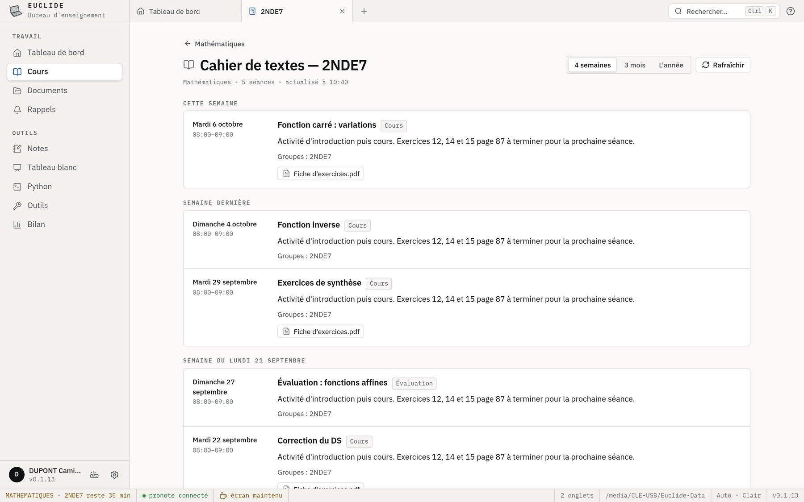

### Tableau blanc

- Une feuille infinie, avec zoom et déplacement, sur fond uni, Seyès, petits carreaux, points ou repère gradué.
- **Règle, équerre, rapporteur et compas**, à leur vraie taille et lisibles à tout zoom. Le stylo suit le bord de la règle, le rapporteur lit un angle, le compas trace arcs et cercles.
- Segments, cercles et rectangles exacts, qui s'accrochent aux points, aux extrémités et aux intersections, et courbes de fonctions `f(x) = …`.
- Export en PNG et en PDF. Le tableau reste couleur papier, même en thème sombre.

### Python

- Chaque script tourne dans son propre processus : `input()` pose sa question dans la console, le bouton Stop arrête tout, une limite de temps coupe les boucles sans fin.
- **turtle et matplotlib** dessinent directement dans Euclide, sans rien installer : le dessin s'affiche dès qu'il arrive, et s'enregistre dans la bibliothèque.
- **« Vérifier » corrige un exercice.** Les exemples (`>>>`) écrits sous une fonction ou une classe, ou un fichier `nom.checks.py`, deviennent des vérifications : réussies, ou l'attendu face à l'obtenu.
- **143 modèles de scripts**, rangés par niveau et par thème : premiers pas, Seconde (nombres, géométrie, fonctions, statistiques, échantillonnage), Première et Terminale (listes, suites, dérivation, exponentielle, intégration, combinatoire, lois de probabilité), Maths expertes (arithmétique, chiffrement, complexes, matrices et graphes), NSI Première et Terminale (données, tables, algorithmes, objets, arbres, graphes), dessins et graphiques. Une recherche les trouve tous ; chacun fonctionne tel quel et passe « Vérifier ». Tout script peut aussi devenir un modèle.
- Un nouvel éditeur : coloration, complétion, recherche. Ctrl+Entrée exécute, Ctrl+Maj+Entrée vérifie.

  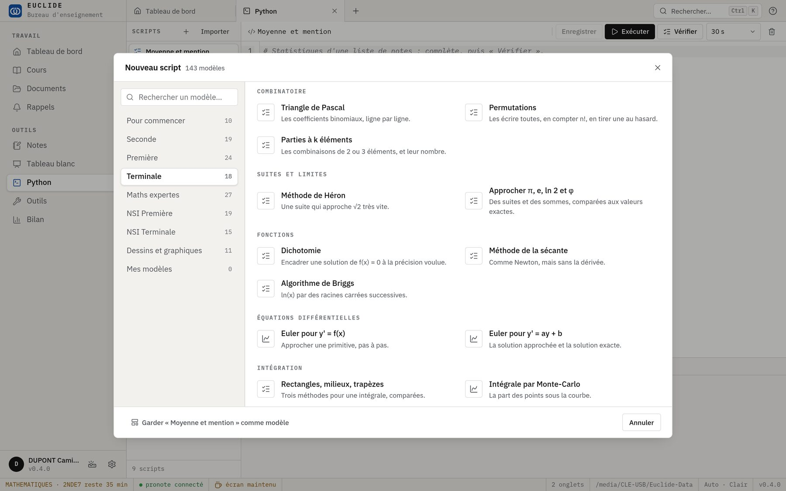
  

  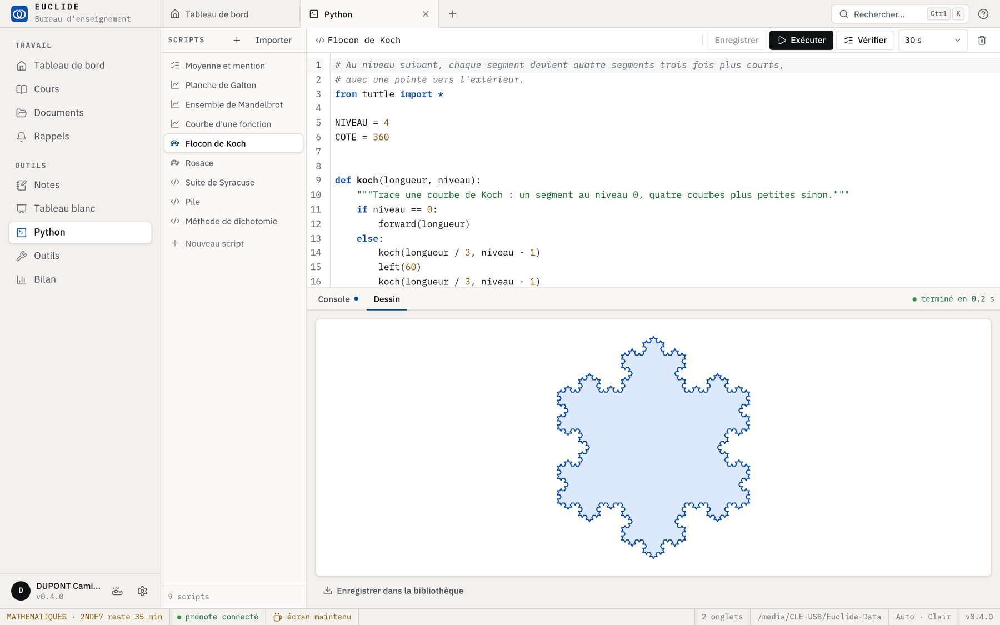
  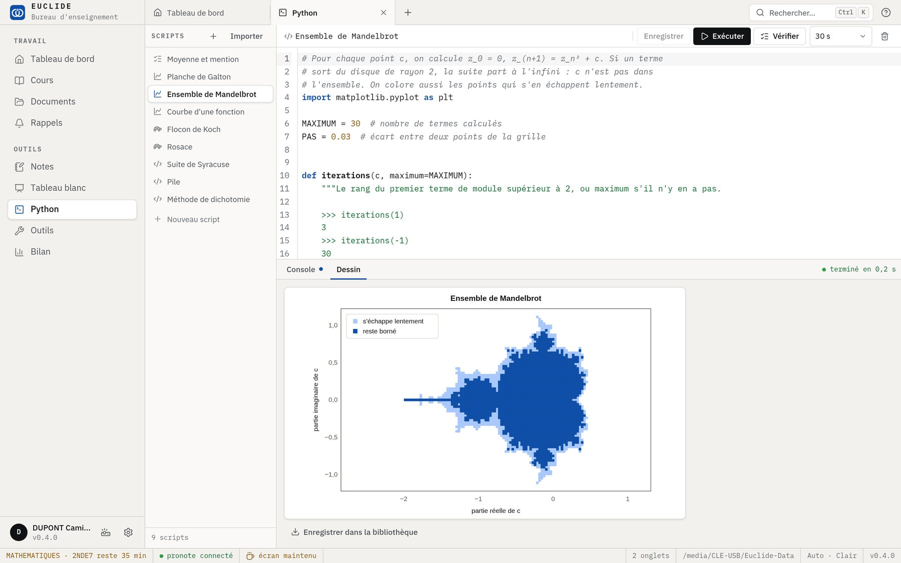

### Notes

- Une note devient un **diaporama** (F5). Une ligne `---` sépare les diapositives, et formules et code s'ajustent à l'écran. Flèches et télécommandes avancent, B ou W donnent un écran noir ou blanc.
- **Export en vrai PDF** (A4, avec en-tête du cours, de la classe et de la date) et impression papier.
- **Modèles** : cours, exercices, évaluation, fiche méthode, activité, et toute note gardée comme modèle.
- Une formule seule sur sa ligne est centrée.

  
  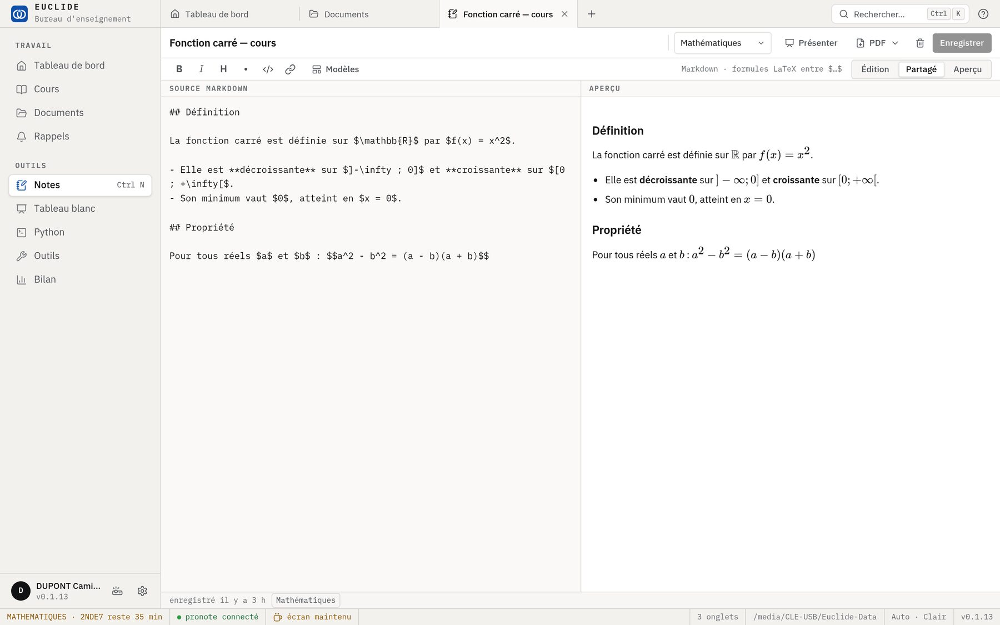

### Documents et recherche

- Les PDF s'ouvrent dans Euclide avec leurs annotations et leurs versions, et une modification non enregistrée n'est plus perdue.
- **Les aperçus** : en grille, chaque document montre sa première page. Recherche dans le texte des documents, et tout au clavier (↑ ↓ Entrée F2 Suppr).
- La palette (Ctrl+K) propose d'abord les documents récents, et cherche aussi dans leur contenu.

  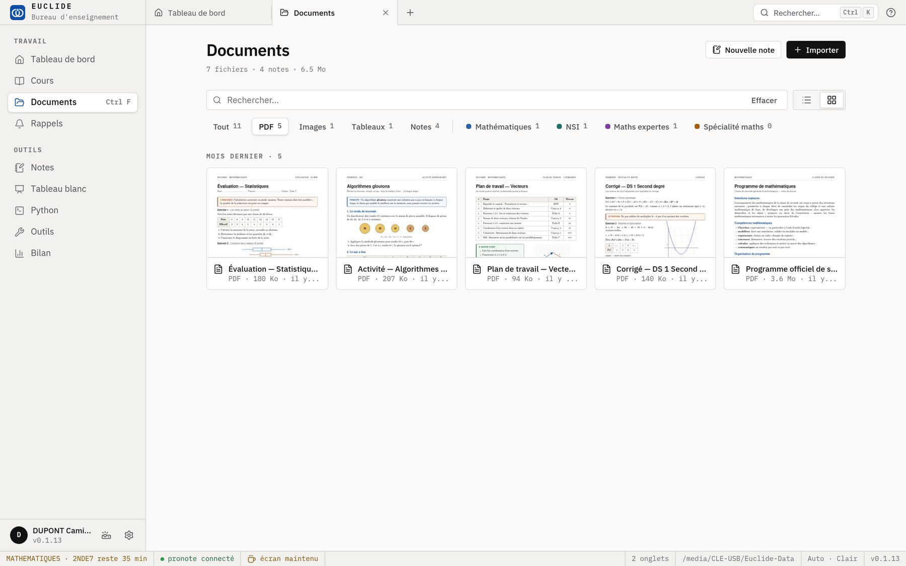
  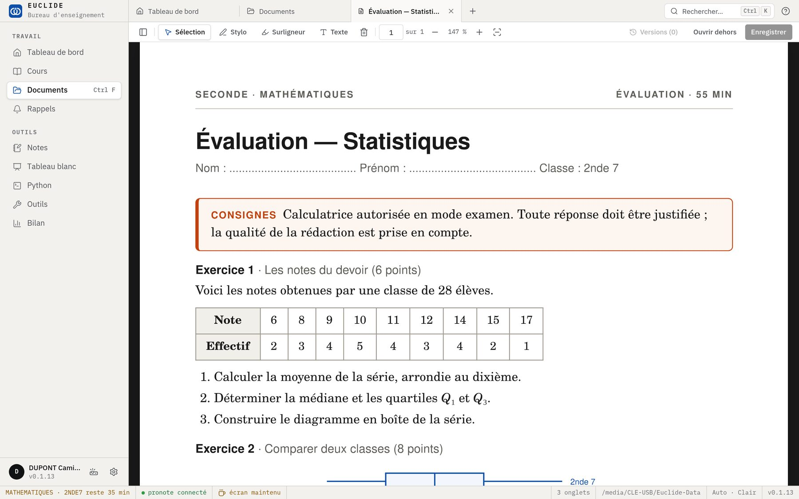

### Interface

- **Un nouveau logo** : deux cercles tracés au compas, et le point où ils se coupent, la première construction des Éléments d'Euclide.
- **Un nouveau design** : les mêmes couleurs, en plus lisible. La sélection en « papier relevé », une seule famille d'icônes, des infobulles partout et un thème sombre soigné.
- Le tableau de bord se recompose autour du cours en cours, de la journée, des rappels et des documents à reprendre.
- Les onglets se déplacent, s'épinglent et se ferment par lots ; un menu les liste quand ils débordent.
- Des raccourcis qui fonctionnent sur un clavier français, et tout au clavier, onglets et choix compris (flèches). Contrastes conformes WCAG 2.1 AA, en clair comme en sombre.
- Une nouvelle version s'annonce dans la barre d'état plutôt qu'en fenêtre par-dessus l'écran, qui peut être projeté.
- Réglages par sections : profil, apparence, Pronote, emploi du temps, sauvegardes restaurables, diagnostic.
- Les rappels s'annulent au lieu de demander confirmation, et se modifient sur place.

  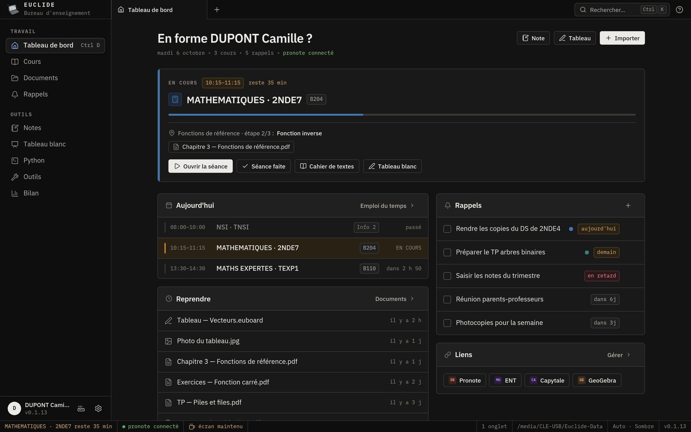
  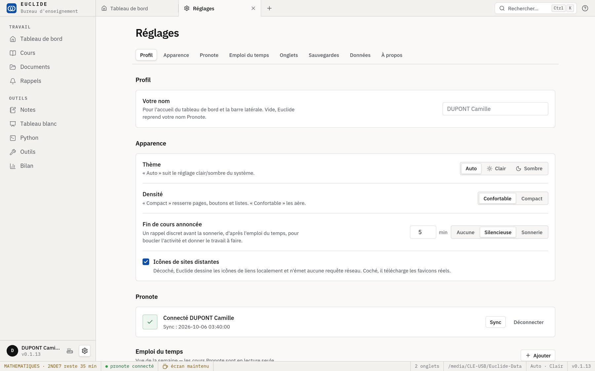

### Fiabilité

- Fermer la fenêtre ne perd plus de travail non enregistré.
- Pronote récupère l'emploi du temps de la semaine en une seule requête au lieu de sept.
- Pronote ne redemande plus le mot de passe à chaque ouverture, ni d'un PC à l'autre. Quand l'établissement le permet, Euclide l'échange contre le jeton de connexion de Pronote, comme l'application mobile, et ne garde aucun mot de passe. Sinon, le mot de passe est chiffré avec une clé rangée dans le dossier de données.
- Si le module Python ne correspond pas à la version d'Euclide (mise à jour interrompue, mise à jour depuis une version 0.1), Euclide le remet en place tout seul.
- Euclide cherche une nouvelle version au démarrage, puis toutes les 6 heures s'il reste ouvert.
- Sous Windows, les processus Python s'arrêtent avec Euclide, même après un plantage.
- Format de données 3 : la mise à niveau est automatique, précédée d'une copie de la base.
- Démarrage et changements d'onglet plus rapides : chaque écran ne se charge qu'à sa première ouverture.

## 0.3.0

**Plus rapide**

- La fenêtre s'ouvre directement à la bonne taille, dans le bon thème, avec les onglets de la séance précédente.
- Plus rien ne fige l'interface : imports, enregistrements et recherche se font en arrière-plan.
- Les PDF s'ouvrent plus vite (1,2 s d'attente en moins à chaque ouverture) ; les fichiers ne sont plus recopiés à l'ouverture.
- Recherche plein texte dans les notes et les PDF.
- Python ne démarre plus au lancement, seulement quand on en a besoin.

**Vos données**

- Sauvegarde automatique chaque jour dans « Euclide-Sauvegardes » (7 jours + 4 semaines), et dans un dossier externe au choix.
- Les documents supprimés restent 30 jours dans la corbeille ; les versions des documents annotés sont conservées.
- La base est vérifiée au démarrage et copiée avant chaque mise à niveau.

**Sécurité**

- Le mot de passe Pronote n'est plus enregistré en clair (chiffré pour l'utilisateur Windows).
- Politique de sécurité du contenu et permissions réduites au strict nécessaire.
- Un seul Euclide à la fois : un deuxième lancement ramène la fenêtre ouverte.

**Mises à jour**

- La version portable remplace son module Python d'un bloc, et Euclide indique la nouvelle version au démarrage suivant.
