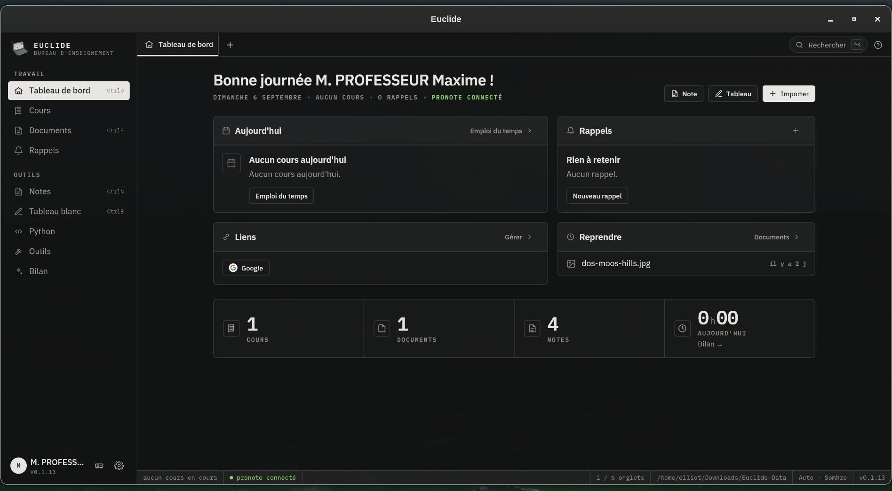

<h1 align="center">Euclide</h1>
<p align="center">Le bureau d'enseignement</p>
<p align="center">
  <a href="https://github.com/cempack/euclide/releases/latest"></a>
</p>

<p align="center">
  
</p>

```bash
npm install && npm run app
npm run app:build
```
